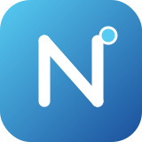

<p align="center">
  
</p>

<h1 align="center">NotiCode</h1>

<p align="center">
  <b>The blue, MCP-native coding agent.</b><br/>
  Runs as an MCP server so Claude (or any MCP client) can plug in, chat, and let it edit files and drive your whole machine.
</p>

<p align="center">
  
  
  
  
</p>

---

## What is this?

NotiCode is an open AI coding agent in the spirit of OpenCode and Claude Code, with one twist: **it speaks [MCP](https://modelcontextprotocol.io) first.**

Launch it and it boots a Model Context Protocol server. Point Claude Desktop, Cursor, or any MCP-compatible client at it, and your assistant suddenly gains hands: it can read and write files, run shell commands, and inspect your system. Prefer a standalone experience? Run the built-in terminal chat agent and talk to NotiCode directly.

It is blue. Not orange. On purpose.

## Features

- **MCP server out of the box** — one command exposes a full toolset over stdio.
- **Real machine access** — read/write/edit files, glob search, run any shell command, query system info.
- **Two ways to run it:**
  - `noticode mcp` — serve tools to Claude and friends.
  - `noticode chat` — an interactive agent loop in your terminal, powered by Claude.
- **Workspace-scoped** — operations are rooted at a workspace you choose.
- **Safety switches** — disable writes or shell execution with one env var.
- **Tiny + hackable** — TypeScript, a clean tool registry, no framework lock-in.

## Quick start

```bash
git clone https://github.com/Antropov31/noticode-mcp.git
cd noticode-mcp
npm install
npm run build
```

Copy the env template and set your key (needed only for `chat`):

```bash
cp .env.example .env
# edit .env and add ANTHROPIC_API_KEY
```

### Mode 1 — MCP server (connect Claude)

```bash
node dist/index.js mcp
# or: npm run mcp
```

Then register it with your MCP client. For **Claude Desktop**, add this to `claude_desktop_config.json`:

```json
{
  "mcpServers": {
    "noticode": {
      "command": "node",
      "args": ["/absolute/path/to/noticode-mcp/dist/index.js", "mcp"],
      "env": {
        "NOTICODE_WORKSPACE": "/absolute/path/to/your/project"
      }
    }
  }
}
```

Restart Claude, and NotiCode's tools show up. Now you just chat in Claude and it can act on your machine through NotiCode.

### Mode 2 — Terminal chat agent

```bash
node dist/index.js chat
# or: npm run chat
```

Talk to it directly. It plans, calls its own tools, and reports back.

```
  ▸█ NotiCode
  the blue coding agent · MCP-native

you › create a python script that prints the fibonacci sequence and run it
noti › Done. Wrote fib.py and ran it — output: 0 1 1 2 3 5 8 13 21 34
```

## Tools

| Tool | What it does |
| --- | --- |
| `fs_read` | Read a text file, optionally a line range. |
| `fs_write` | Create or overwrite a file (makes parent dirs). |
| `fs_edit` | Exact-match string replacement inside a file. |
| `fs_list` | List files and directories under a path. |
| `fs_search` | Glob for files, optionally grep their contents. |
| `shell_exec` | Run any shell command on the host. |
| `sys_info` | OS, CPU, memory, user, workspace. |

All tools are defined once in `src/tools/` and shared by both the MCP server and the chat agent. Adding a tool is a few lines.

## Configuration

| Env var | Default | Purpose |
| --- | --- | --- |
| `ANTHROPIC_API_KEY` | — | Required for `chat` mode. |
| `NOTICODE_WORKSPACE` | `cwd` | Root directory the agent operates in. |
| `NOTICODE_MODEL` | `claude-sonnet-4-20250514` | Model used in chat mode. |
| `NOTICODE_ALLOW_SHELL` | `true` | Set `false` to block shell execution. |
| `NOTICODE_ALLOW_WRITE` | `true` | Set `false` to make the agent read-only. |
| `NOTICODE_MAX_OUTPUT` | `30000` | Max chars returned per tool call. |

## Security

NotiCode can run arbitrary commands and modify files. That is the whole point, and also the whole risk. Run it against projects you trust, scope `NOTICODE_WORKSPACE` tightly, and flip `NOTICODE_ALLOW_SHELL=false` / `NOTICODE_ALLOW_WRITE=false` when you only need read access.

## Project structure

```
src/
  index.ts            CLI entry (mcp | chat | help)
  config.ts           Env-based configuration
  theme.ts            Blue terminal palette + banner
  mcp/
    server.ts         Registers tools on the MCP server (stdio)
  agent/
    agent.ts          Interactive chat loop with Anthropic tool-use
  tools/
    index.ts          Tool registry
    types.ts          Shared tool + context types
    filesystem.ts     fs_read / fs_write / fs_edit / fs_list / fs_search
    shell.ts          shell_exec
    system.ts         sys_info
```

## Roadmap

- [ ] HTTP / SSE transport in addition to stdio
- [ ] Streaming responses in chat mode
- [ ] Pluggable LLM providers (OpenAI, local models)
- [ ] Per-tool permission prompts
- [ ] Git-aware diffs before writes

## License

MIT © Antropov31
